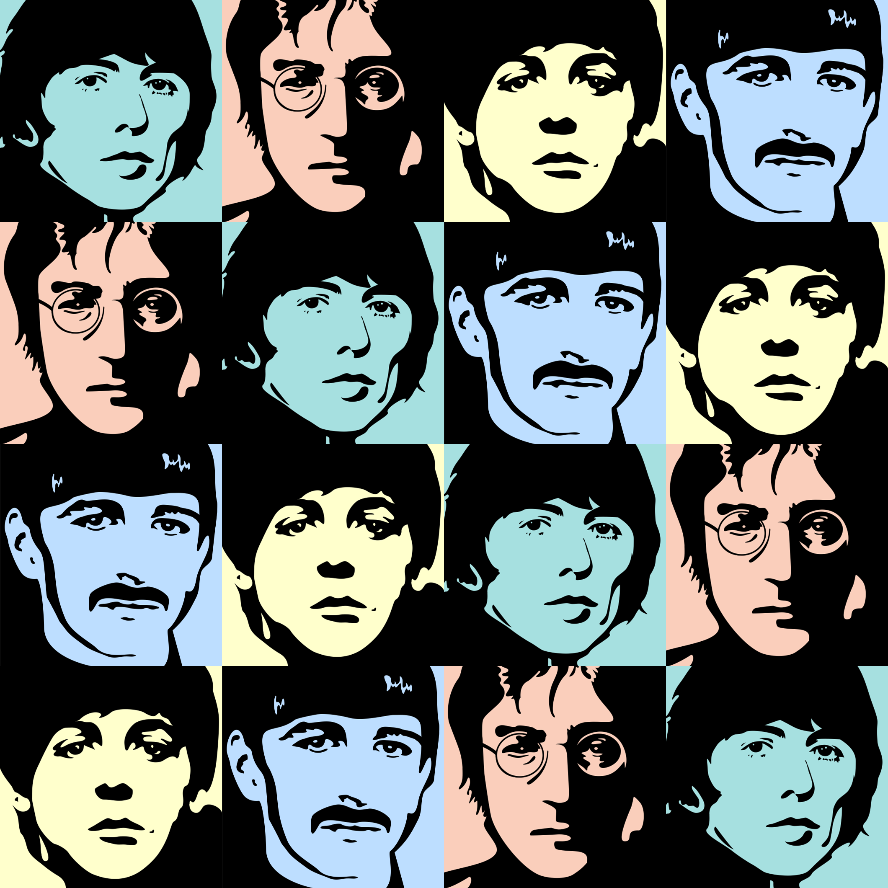

# Beatles squares generator

<b>This project mixes art, science, and The Beatles by introducing <i>Beatles squares</i></b>.
 
All 576 unique Beatles squares are <a href="images/BeatlesSquares/">here</a>.

## The Beatles

[The legendary Beatles](https://en.wikipedia.org/wiki/The_Beatles) are (in alphabetical order by last name):
- *George Harrison*
- *John Lennon*
- *Paul McCartney*
- *Ringo Starr*

Here they are on portraits painted with great respect and love in our studio:

## Beatles squares

A Beatles square is a 4x4 table filled with members of The Beatles such that each row and each column contains all four members.

**Example of a Beatles square:**

## Types of Beatles squares

Let's enumerate cells of a Beatles square as follows:  
11 12 13 14  
21 22 23 24  
31 32 33 34  
41 42 43 44  

A Beatles square can have the following main properties:
- *alphabetiacal* - the first row and first column are in alphabetical order by the last name, i.e. the order is: George Harrison, John Lennon, Paul McCartney, Ringo Starr. Cells of the first row are: 11 12 13 14, while cells of the first column are: 11 21 31 41.
- *cross* - all four elements of the main diagonal are equal to each other, i.e. it contains only one member of the Beatles. The same holds for the main antidiagonal. As a result, a clear digonal cross is formed. 
- *diagonal* - the main diagonal contains all four members of The Beatles, the same holds for the main antidiagonal. In other words, all elements of these diagonals are distinct just like in all rows and columns. The main diagonal is: 11 22 33 44, the main antidiagonal is: 14 23 32 41.
- *mirror*
- *parallel*

Based on these properties, 576 Beatles squares were divided into *ordinary*, *advanced*, *rare*, and *super rare* squares.

The *ordinary* class if formed by 407 Beatles squares with no mentioned properties. The Beatles square from the example above belongs to this class.

There are only 4 *alphabetical* Beatles squares.  
An example is:

TODO

## Generator

The script generator.py generates all of them and (optionally) plots images to files.

## Required packages

python3.6+

## Usage

python3 ./generate.py plot_num

where plot_num is the number of Beatles squares to plot, at most 576.

## NFT collection

Beatles squares is an NFT collection comprised of 576 unique items. The items are based on portraits of The Beatles, exclusively made for this collection, and a combinatorial design known as Latin square. There are 407 ordinary, 142 advanced, 23 rare, and 4 super rare squares. The collection is dedicated to a long-awaited release of The Beatles: Get Back documentary series. We are mixing art, science, and The Beatles to promote this series. Come together, right now, over NFT!

