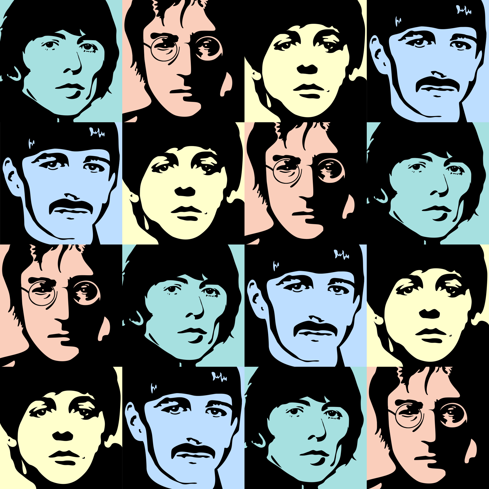

# Beatles squares

<b>This project mixes art, science, and The Beatles by introducing <i>Beatles squares</i></b>.
 
All 576 unique Beatles squares are <a href="images/BeatlesSquares/">here</a>.

## NFT collection

*Beatles squares* is an NFT collection comprised of 576 unique items. The collection is promoting and celebrating a long-awaited release of [The Beatles: Get Back](https://www.disneyplus.com/en-gb/series/the-beatles-get-back/7DcWEeWVqrkE) documentary series. The series will premiere on 25th November 2021 and the NFT drop is starting on [OpenSea](https://opensea.io/collection/beatlessquares) the same day. Come together, right now, over NFT!

## Media
As seen on 

## The Beatles

[The legendary Beatles](https://en.wikipedia.org/wiki/The_Beatles) are (in alphabetical order by last name):
- *George Harrison*
- *John Lennon*
- *Paul McCartney*
- *Ringo Starr*

Here they are on portraits painted with great respect and love in our studio:

## Beatles squares

A Beatles square is a 4x4 table filled with members of The Beatles such that each row and each column is The Beatles, i.e. it contains all the four members. Beatles squares is a special case of a well-known combinatorial design known as [Latin square](https://en.wikipedia.org/wiki/Latin_square).

**Example of a Beatles square:**

## Properties

Let's enumerate cells of a Beatles square as follows:  
11 12 13 14  
21 22 23 24  
31 32 33 34  
41 42 43 44  

Cells of the first row are 11 12 13 14, while ones of the first column are 11 21 31 41, for the main diagonal are 11 22 33 44, and finally for the main antidiagonal are 41 32 23 14.

A Beatles square may have the following main properties:
- *alphabetiacal* - the first row and first column are in alphabetical order by the last name, i.e. the order is: George Harrison, John Lennon, Paul McCartney, Ringo Starr.
- *cross* - all four elements of the main diagonal are equal to each other, i.e. it contains four instances of one member of the Beatles. The same holds for the main antidiagonal (but the member is different). As a result, a clear (digonal) cross is formed. 
- *diagonal* - the main diagonal is The Beatles, i.e. it contains all the four members, the same holds for the main antidiagonal. In other words, all elements of these two diagonals are distinct just like in all rows and columns, so 10 The Beatles are formed instead of 8.
- *mirror* -  the main diagonal is considered a mirror, i.e. cells from the left-bottom triangle are reflected to the ones from the right-top triangle. The same holds for the main antidiagonl.
- *parallel* - each diagonal (or each antidiagonal) contains instances of only one member of The Beatles. As a result, the square looks like a set of parallel lines.

An example of diagonal Beatles square is:

And here is an example of parallel one:

## Classes

There are 576 unique Beatles squares. Based on the properties, they are divided into 4 classes: *ordinary*, *advanced*, *rare*, and *super rare*.
- *ordinary*: 407 squares with no mentioned properties. The Beatles square from the first example belongs to this class.
- *advanced*: 142 squares with exactly one of the following properties: cross, diagonal, mirror, parallel.
- *rare*: 23 squares with two properties cross and mirror, i.e. cross-mirror squares.
- *super rare*: 4 alphabetical squares. In fact, only one of them is pure alphabetical, while the others are alphabetical-mirror, alphabetical-parallel, and alphabetical-cross-mirror.

The alphabetical-cross-mirror square is:

## Required packages

python3.6+

## Usage

python3 ./generate.py plot_num

  plot_num: integer; the number of Beatles squares to plot; default is 0; maximal value is 576.

The script generates all Beatles squares and plot images of the first plot_num of them to files.

## Full version

The current version is a restricted one since Beatles squares are only generated but not saved to files as images.
Should you need the full version, please contact us.
